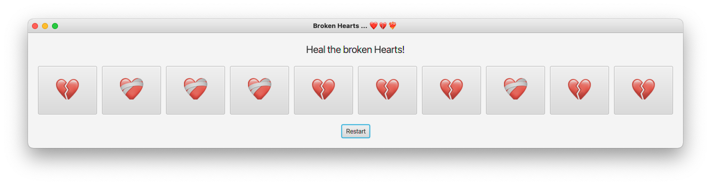
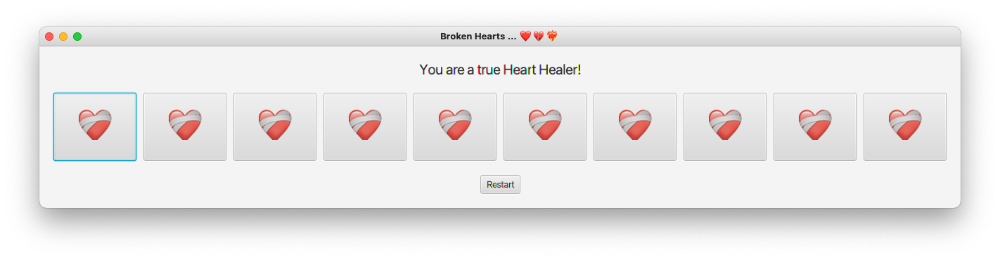

# 2703_BrokenHearts

## Aufgabe
Implementiere das Spiel "Broken Hearts"!

Zu Beginn werden 10 Buttons erzeugt, welche zufällig ein gebrochenes oder ein geheiltes Herz anzeigen.

Der Spieler muss nun versuchen, alle gebrochenen Herzen zu heilen. Er erreicht dies, in dem er ein Herz anklickt. Ein bereits
geheiltes Herz verwandelt sich durch einen Klick wieder in ein gebrochenes.

Restart "mischt" die Buttons wieder neu und ein neues Spiel kann beginnen.
